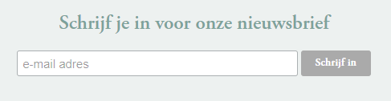

# PE1 opdracht  

Maak voor deze opdracht een Blazor Server applicatie die [open data](https://nl.wikipedia.org/wiki/Open_data) visualiseert.

Je kiest zelf één gekozen open data set. Je kan hiervoor bijvoorbeeld onderstaande lijsten raadplegen:

- [Open Data Brugge](https://www.brugge.be/opendata)
- [Open Data Oostende](https://www.oostende.be/opendata)
- [Open Data Gent](https://data.stad.gent/)
- [Open Data Antwerpen](https://www.antwerpen.be/open-data)
- [Open Data Vlaanderen](https://www.vlaanderen.be/datavindplaats)
- [Open Data België](https://data.gov.be/en)
- [Open Data Europa](https://data.europa.eu/en)
- [GitHub repo met links naar verschillende open data sets](https://github.com/awesomedata/awesome-public-datasets)

## Omschrijving

- Je maakt overzichtspagina van alle items in je dataset. Dit is dan ook de 'homepage' van je applicatie. Je toont niet alle properties van je dataset maar toont de belangrijkste. Je kan hiervoor bijvoorbeeld een tabel gebruiken.

- Wanneer er geklikt wordt op een item uit de homepage dient men terecht te komen op een pagina waarop je de details van je data ziet.

- Je maakt een formulier om een nieuwe item toe te voegen aan je dataset (**in memory**). Je zal dus bij het starten van je applicatie je dataset moeten uitlezen, omzetten naar C# objecten en deze in een collectie **in het geheugen** bijhouden. 

- Dit formulier dient te bestaan uit een aantal input velden die relevant zijn voor je gekozen dataset.

- Je maakt een formulier om een bestaand item te wijzigen (**in memory**). Dit formulier dient te bestaan uit een aantal input velden die relevant zijn voor je gekozen dataset.

- Je voorziet de mogelijkheid om een item te verwijderen (**in memory**).

- Aangezien je de data na het inlezen in memory bijhoudt is het dus volledig normaal dat je aanpassingen terug verdwenen zijn wanneer je je applicatie terug opstart.

- Voorzie op **elke pagina** een mogelijkheid om in te schrijven in op een fictieve nieuwsbrief. Een gebruiker dient hiervoor enkel zijn e-mailadres in te vullen. 
Na het klikken op een knop om in te schrijven verberg je de component en toon je een gepaste melding aan de gebruiker. Verder hoef je niks te doen, het e-mailadres dient dus niet in de database te worden bijgehouden.

Voorbeeld:

## Uitwerking

- Je maakt zoveel mogelijk gebruik van Blazor componenten

- Je verzorgt de layout van je uitwerking, je maakt een grafisch verzorgde applicatie. Je mag hiervoor aan de slag met Bootstrap, ga hiervoor even op zoek naar de [Bootstrap componenten documentatie](https://getbootstrap.com/docs/5.0/getting-started/introduction/).

## Project
Er is reeds een .Blazor en .Core project voorzien. Voorzie hierin de nodige code en hou rekening met Seperation Of Concerns.

- Maak, waar nodig, zoveel mogelijk gebruik van eigen componenten.
- Maak geen gebruik van externe Blazor UI frameworks.

## Data

- Je dient de data van je gekozen dataset te downloaden (formaat maakt niet uit) en toe te voegen in de reeds bestaande **Data** folder in je **Core** project. Zodat ik tijdens het evalueren van je opdracht de data kan gebruiken. *Je gaat dus in je applicatie niet naar een externe API om de data op te halen!*

- Je zorgt voor een .csv, .json of .xml bestand met de data. Dit bestand lees je dan uit en zet je om naar een lijst van objecten. Deze lijst van objecten kan je dan gebruiken in je applicatie. Websites die je hiermee kunnen helpen zijn;
	- [https://json2csharp.com/](https://json2csharp.com/) (JSON -> C# en XML -> C#)
	- [https://www.convertcsv.com/](https://www.convertcsv.com/)
	- [https://joshclose.github.io/CsvHelper/](https://joshclose.github.io/CsvHelper/) (Nuget package voor C# om CSV uit te lezen)
	- [System.Text.Json docs](https://learn.microsoft.com/en-us/dotnet/api/system.text.json?view=net-6.0)
	- [Newtonsoft docs](https://www.newtonsoft.com/json)
	- [Verschil tussen System.Text.Json en Newtonsoft.Json mogelijkheden](https://learn.microsoft.com/en-us/dotnet/standard/serialization/system-text-json/migrate-from-newtonsoft?pivots=dotnet-6-0)

- Voorzie dat je bestand in je Core project wordt gecompileerd. Dit kan je doen door het bestand toe te voegen aan je Core project en het als '**Content**' te markeren. [Meer info](https://learn.microsoft.com/en-us/visualstudio/ide/build-actions?view=vs-2022). Deze stap is zéér belangrijk, zo ben ik zeker dat ik tijdens je evaluatie ook met je zelfde dataset kan werken. 
- Zoek even op hoe je dit bestand kan benaderen/uitlezen in je code.

